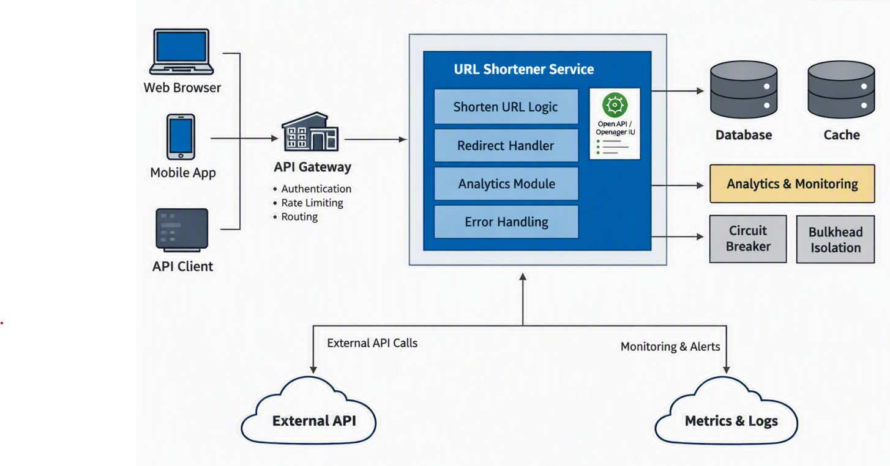
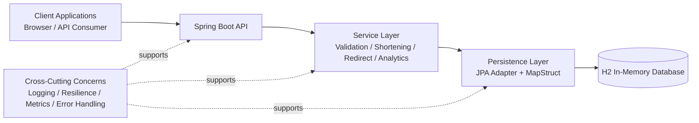
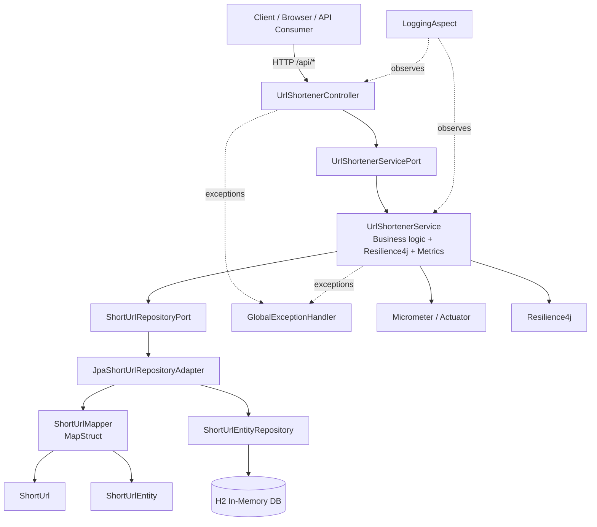
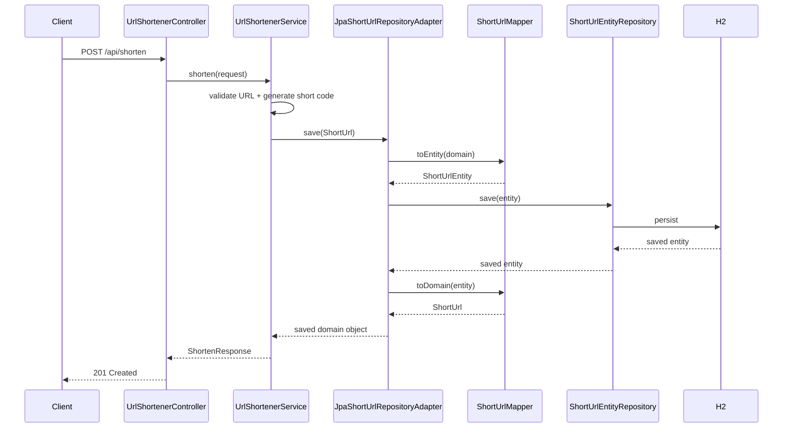

# Architecture Overview

## Purpose
This service is a runnable URL shortener prototype that exposes REST endpoints for:
- creating a short code for a long URL
- resolving a short code back to its original URL
- viewing aggregate analytics

## High-Level Diagram

The following image is the primary high-level architecture diagram for submission:

How to interpret it for this prototype:
- The core URL shortener service box matches the implemented Spring Boot application
- Database is implemented using H2 in-memory storage
- Analytics and monitoring are implemented through Micrometer, Actuator, Prometheus metrics exposure, and application logging
- Circuit breaker and bulkhead isolation are implemented through Resilience4j annotations in the service layer
- API Gateway, Cache, and External API blocks should be treated as conceptual extension points in the high-level design, not as fully implemented runtime components in this prototype
- The Mermaid diagrams below show the exact current implementation structure and request flow in the codebase

## Main Components
- `UrlShortenerController`: HTTP entry point for `/api/shorten`, `/api/{shortCode}`, and `/api/analytics`
- `UrlShortenerServicePort`: service contract used by the controller
- `UrlShortenerService`: service-layer implementation with resilience, validation, short-code generation, collision retry, and metrics
- `ShortUrlRepositoryPort`: domain-facing persistence contract
- `JpaShortUrlRepositoryAdapter`: adapter that translates domain objects to JPA entities and back using MapStruct and converts duplicate-key writes into collision exceptions
- `ShortUrlMapper`: MapStruct mapper between `ShortUrl` and `ShortUrlEntity`
- `ShortUrlEntityRepository`: Spring Data JPA repository
- `GlobalExceptionHandler`: maps domain exceptions to API responses
- `LoggingAspect`: request-aware AOP logging for controllers and services

## Tools And Frameworks
- Java 17
- Spring Boot 3.3.2
- Spring Web for REST endpoints
- Spring Data JPA for persistence access
- H2 in-memory database for the prototype runtime
- MapStruct for entity/domain mapping
- Resilience4j for circuit breaker, retry, and bulkhead behavior
- Micrometer and Actuator for metrics and health endpoints
- JUnit 5, MockMvc, Mockito for automated tests
- Cucumber + Gherkin for headless acceptance tests
- JaCoCo for code coverage measurement and threshold enforcement

## Execution Approach
The code follows a layered, ports-and-adapters style:
- controller layer handles HTTP and response types
- service layer owns business logic and resilience behavior
- repository port isolates persistence from service logic
- persistence adapter implements the port with JPA and mapping

This keeps the controller small, makes service behavior easier to test, and allows persistence details to change with limited impact on core logic.

## Component Diagram

## Control Flow
### Shorten flow
1. Client sends `POST /api/shorten`
2. `UrlShortenerController` delegates to `UrlShortenerServicePort`
3. `UrlShortenerService` validates the URL and generates a candidate short code
4. `JpaShortUrlRepositoryAdapter` maps the domain object to `ShortUrlEntity` using `ShortUrlMapper`
5. Repository persists the entity under a database uniqueness constraint on `shortCode`
6. If a duplicate-key collision occurs, the adapter raises a collision exception and the service generates a new code and retries the insert
7. The service retries up to 5 attempts before failing with a conflict response
8. On success, the service returns `ShortenResponse`
9. Controller responds with HTTP 201

### Resolve flow
1. Client sends `GET /api/{shortCode}`
2. Controller delegates to the service
3. Service loads the domain object through the repository port
4. Service increments redirect count and saves the updated object
5. Controller returns HTTP 301 redirect to the original URL

### Analytics flow
1. Client sends `GET /api/analytics`
2. Controller delegates to the service
3. Service reads all links and aggregates redirect counts
4. Controller returns analytics payload with HTTP 200

## Request Sequence Diagram

## Cross-Cutting Behavior
- `LoggingAspect` logs controller and service method execution, result, and failures
- `GlobalExceptionHandler` converts domain exceptions into stable API error payloads
- Resilience4j annotations protect service methods from transient failures
- business exceptions such as invalid URL and unknown short code are excluded from resilience failure counting

## Observability
### Logging
- Application logs are produced through `LoggingAspect` and standard Spring Boot logging
- Log lines include HTTP-aware context for controller and service calls
- Log correlation is enabled by including `traceId` and `spanId` in the logging pattern

### Metrics
- Spring Boot Actuator exposes runtime and framework metrics
- Prometheus scraping is enabled through the `/actuator/prometheus` endpoint
- Custom business counters track shorten, resolve, and analytics requests

### Tracing
- Micrometer tracing is bridged to OpenTelemetry
- Tracing is wired and can be enabled with `TRACING_ENABLED=true`
- When enabled, trace sampling is configured for all requests in this prototype
- Traces are exported through OTLP to a collector endpoint configured by `OTEL_EXPORTER_OTLP_TRACES_ENDPOINT`
- This gives end-to-end request traces and enables correlation between traces and log lines

### Important distinction
- Prometheus is used here for metrics
- OpenTelemetry is used here for tracing and log correlation context
- Logs themselves are still written through the application logging system; exporting logs to Splunk or another backend would typically be done through a log shipper, a logback appender, or an OpenTelemetry Collector pipeline
- If no OTLP collector is running, tracing should remain disabled to avoid exporter connection errors

## Key Decisions
- Use H2 in-memory storage for a fast, runnable prototype instead of production-grade persistence
- Keep resilience at the service layer so controllers remain thin and HTTP-focused
- Use MapStruct instead of manual mapping to keep adapter code small and consistent
- Use a repository port and adapter to preserve separation between domain logic and persistence technology
- Use Cucumber for readable acceptance tests so non-developers can review expected behavior
- Enforce short-code uniqueness in the database and treat collision recovery as an application concern with bounded retry

## Known Limits
- Data is not durable across restarts because H2 is in-memory
- Short code generation is simple and not optimized for high-scale collision avoidance, though collisions are retried up to a fixed limit
- Analytics are aggregate-only and do not expose per-link reporting
- No authentication, authorization, or rate limiting is implemented
